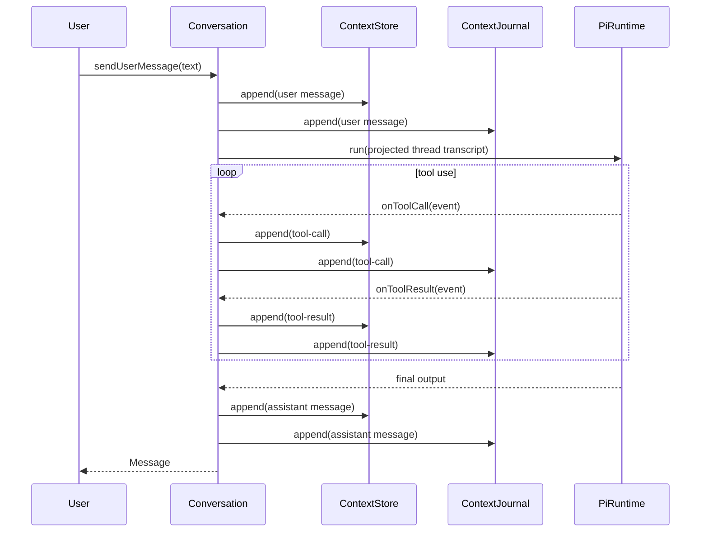

# Architecture

`termy` is a small pnpm workspace monorepo for experimenting with a terminal-based agent.

This document describes the **current implementation architecture**.
For the broader context-first design philosophy, see [`docs/context-model.md`](context-model.md).

## Packages

- `packages/core` — shared context types, storage, projection, and conversation orchestration
- `packages/cli` — terminal entrypoint and Pi SDK-backed runtime wiring

Keep reusable logic in `@termy/core` and terminal-specific behavior in `@termy/cli`.

---

## Main Components

### `@termy/core`

Core currently contains these main building blocks:

- `context-types.ts` — typed context records such as `message`, `thread`, `tool-call`, and `tool-result`
- `context.ts` — `createContextNode(...)`
- `context-store.ts` — in-memory append-only store with thread-scoped queries
- `context-journal.ts` / `context-journal-jsonl.ts` — append-only persistence interface and JSONL implementation
- `pi-projection.ts` — converts selected contexts into runtime input text
- `pi-runtime.ts` — runtime interface and helpers
- `conversation.ts` — thread-scoped orchestration for one user↔assistant exchange
- `context-identity.ts` — helpers for ensuring `user`, `agent`, and `thread` contexts exist

### `@termy/cli`

CLI currently provides:

- REPL entrypoint in `packages/cli/src/index.ts`
- runtime adapter in `packages/cli/src/pi-sdk-runtime.ts`
- tool/system-prompt configuration in `packages/cli/src/termy-runtime-config.ts`

---

## Data Model Used by the Current Implementation

The codebase stores runtime state as `ContextNode` records.

```ts
type ContextNode<TType, TPayload> = {
  id: ContextId;
  type: TType;
  payload: TPayload;
  createdAt: Date;
  createdBy?: ContextId;
};
```

The currently defined context categories are:

| Category     | Types |
|--------------|-------|
| Actors       | `User`, `Agent`, `System` |
| Conversation | `Session`, `Thread`, `Message` |
| Execution    | `Capability`, `ToolDefinition`, `ToolCall`, `ToolResult` |

In the current runtime flow, the most actively used records are:

- `thread`
- `message`
- `tool-call`
- `tool-result`
- `user` / `agent` during CLI bootstrap

---

## Storage Layer

### `ContextStore`

`ContextStore` is an in-memory append-only store.

```ts
interface ContextStore {
  append(context: AnyContext): void;
  appendMany(contexts: AnyContext[]): void;
  get(id: ContextId): AnyContext | undefined;
  list(): AnyContext[];
  listThread(threadId: ContextId): AnyContext[];
  latestMessage(threadId: ContextId): Message | undefined;
}
```

Current thread-scoped behavior:

- `thread` is the main query boundary
- `listThread(threadId)` returns the matching `thread`, thread messages, and thread tool calls/results
- other context types may exist in the store without being returned by `listThread(...)`

### `ContextJournal`

`ContextJournal` is a small append-only persistence interface.

```ts
interface ContextJournal {
  append(context: AnyContext): void;
  appendMany(contexts: AnyContext[]): void;
}
```

The default implementation is JSONL-backed:

- `createJsonlContextJournal(path)` appends contexts to disk
- `loadContextsFromJsonl(path)` restores prior contexts into memory at startup

`Conversation` writes to the store first and then to the journal when configured. This is a sequential write path, not a transactional one.

---

## Projection Layer

`pi-projection.ts` converts stored contexts into the text transcript sent to the runtime.

```ts
function projectContextsToPi(input: {
  contexts: AnyContext[];
  threadId?: ContextId;
  mode?: PiProjectionMode;   // "conversation-only" | "with-tool-results"
  systemPrompt?: string;
}): PiProjection
```

Current behavior:

- includes `thread` contexts for the selected thread
- includes `message` contexts for the selected thread
- includes `tool-call` and `tool-result` only in `with-tool-results` mode
- does not currently include `user`, `agent`, `system`, `capability`, or `tool-definition`

Output shape:

```ts
type PiProjection = {
  systemPrompt?: string;
  transcript: string;
};
```

`toPiInput(...)` in `pi-runtime.ts` wraps this into the `PiRunRequest` sent to the runtime.

---

## Execution Layer

### `PiRuntime`

`PiRuntime` is the abstraction used by core to talk to the model backend.

```ts
interface PiRuntime {
  run(request: PiRunRequest, hooks?: PiRuntimeRunHooks): Promise<PiRunResult>;
}
```

Runtime hooks expose:

- text deltas
- tool call events
- tool result events

### `Conversation`

`Conversation` orchestrates a single thread.

```ts
interface Conversation {
  threadId: ContextId;
  sendUserMessage(text: string, hooks?: PiRuntimeRunHooks): Promise<Message>;
  listThread(): AnyContext[];
}
```

Current responsibilities:

1. ensure the thread exists
2. append the user message
3. project the current thread into runtime input
4. listen for tool events from the runtime
5. persist tool-call and tool-result contexts
6. append the final assistant message

---

## CLI Runtime Wiring

The CLI currently wires the system together like this:

1. Open or create `.termy/sessions/main.jsonl`
2. Load prior contexts with `loadContextsFromJsonl(...)`
3. Create `ContextStore`
4. Ensure default `thread`, `user`, and `agent` contexts exist
5. Persist any newly created bootstrap contexts to the journal
6. Create `Conversation`
7. Repeatedly read input from the REPL and call `conversation.sendUserMessage(...)`

The CLI runtime adapter in `packages/cli/src/pi-sdk-runtime.ts` uses `@mariozechner/pi-coding-agent` and currently:

- creates a fresh Pi agent session per `run(...)`
- provides tools: `read`, `bash`, `edit`, `write`, `grep`, `find`, `ls`
- forwards text deltas and tool execution events into `PiRuntimeRunHooks`

---

## Runtime Flow

One call to `conversation.sendUserMessage(...)` works like this:



Persisted events currently include:

- user messages
- tool calls
- tool results
- final assistant messages

Text deltas are observable through hooks but are not currently stored as contexts.

---

## Current Constraints

### Thread-first structure

Although `Session` exists as a type, the current implementation is primarily thread-oriented:

- `Conversation` is created with one `threadId`
- `listThread(...)` is the main query API
- projection is thread-filtered

### Some context types are present but lightly used

The type system includes `Capability` and `ToolDefinition`, but the CLI flow does not yet build a full registry around them.

### `createAgent(...)` is a convenience wrapper

`packages/core/src/index.ts` also exports a small `createAgent(...)` helper with `run(input: string): Promise<string>`. That helper is simpler than the thread-based conversation architecture and is not the main path used by the CLI.
