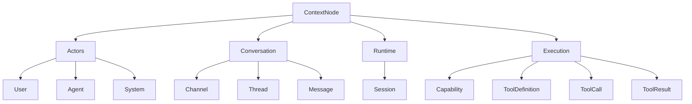

# Context Model

This document describes the **design philosophy** behind `termy`.
For the current implementation architecture, see [`docs/architecture.md`](architecture.md).

## Core Idea

The long-term design direction of `termy` is:

> **everything is context**

That means the system should represent its important state and observable events using one common structure:

```ts
type ContextNode<TType, TPayload> = {
  id: ContextId;
  type: TType;
  payload: TPayload;
  createdAt: Date;
  createdBy?: ContextId;
};
```

The intent is not just to store chat messages. The broader idea is to model participants, conversation structure, tool activity, and eventually coordination between agents in the same general form.

---

## Why Use a Context Model?

A context-first model gives the system a few useful properties.

### 1. Uniformity

Instead of having one shape for messages, another for tool logs, and another for actor state, the system can describe them all as typed context records.

### 2. Observability

If user input, tool calls, tool results, and assistant replies are all stored as contexts, it becomes easier to inspect what happened during a run.

### 3. Replayability

Append-only records can be persisted and later replayed into memory.
That makes it easier to restore sessions and reason about prior execution state.

### 4. Composability

When the data model is uniform, different layers can consume the same raw records for different purposes:

- projection into model input
- persistence
- debugging
- analytics
- future orchestration logic

---

## Context Categories

The broader design direction points toward a conversation hierarchy that separates shared spaces from individual discussion lines.



Conceptually:

- **Actors** describe who participates
- **Conversation** describes how interaction is organized
- **Runtime** describes a live interaction instance such as a CLI/app session
- **Execution** describes what the system tried to do and what happened

A useful long-term distinction is:

- `Channel` — a shared space that groups related threads
- `Thread` — one scoped conversation within a channel
- `Session` — a runtime interaction instance, not a conversation container

This is broader than a plain chat transcript.

---

## Agent as a Context Processor

A useful way to think about an agent in this model is:

- it **reads contexts**
- it **produces contexts**

That is a stronger abstraction than “an agent is just a function from string to string”.

A possible future-oriented signature looks like this:

```ts
type AgentRun = (contexts: AnyContext[]) => Promise<AnyContext[]>
```

This is not the full current implementation, but it captures the intended direction well.

---

## Projection Is a View, Not the Whole Model

An important design point is that the stored context graph and the model input are not the same thing.

The store may contain many context records, while the runtime only needs a selected projection of them for one run.

That separation matters because it allows:

- different projections for different tasks
- richer stored state than what is sent to the model
- future changes to prompting without changing persistence format

So in this design, projection is a **derived view** over contexts, not the source of truth.

---

## Persistence as an Append-Only Journal

The context model fits naturally with append-only persistence.

Instead of mutating a large in-memory object graph and serializing the whole thing, the system can record context events over time.

This supports:

- restoring prior state by replay
- inspection of execution history
- durable logs of model and tool activity

The current JSONL journal is a simple version of that idea.

---

## Why Channels and Threads Matter

Even in a broader context model, both `channel` and `thread` are useful scopes.

A channel gives the system a practical unit for:

- grouping related work
- defining shared participants or visibility
- holding multiple concurrent threads

A thread gives the system a practical unit for:

- querying related messages
- projecting relevant execution records
- scoping a conversation loop
- isolating one line of discussion inside a larger channel

So the philosophy is not “everything is one giant undifferentiated context bag”.
It is “everything important can be represented as context, with useful scopes such as channels and threads layered on top”.

---

## Multi-Agent Direction

The context model also suggests a path toward multi-agent coordination.

If multiple agents share a common store, then coordination can be expressed through context records instead of a separate custom messaging abstraction.

Possible future patterns include:

- delegation contexts
- shared channels containing multiple private or shared threads
- agent-specific projections
- orchestration loops that watch for specific context types

In that world, agents communicate by reading and appending contexts.

---

## Important Caveat

This document describes the **intended design direction**, not a claim that every part is fully implemented today.

Today, `termy` already uses context records as its main data model in several important places, but some parts of the full context-first vision are still future-facing.

That is why this philosophy is documented separately from [`docs/architecture.md`](architecture.md), which focuses on the current code structure.
