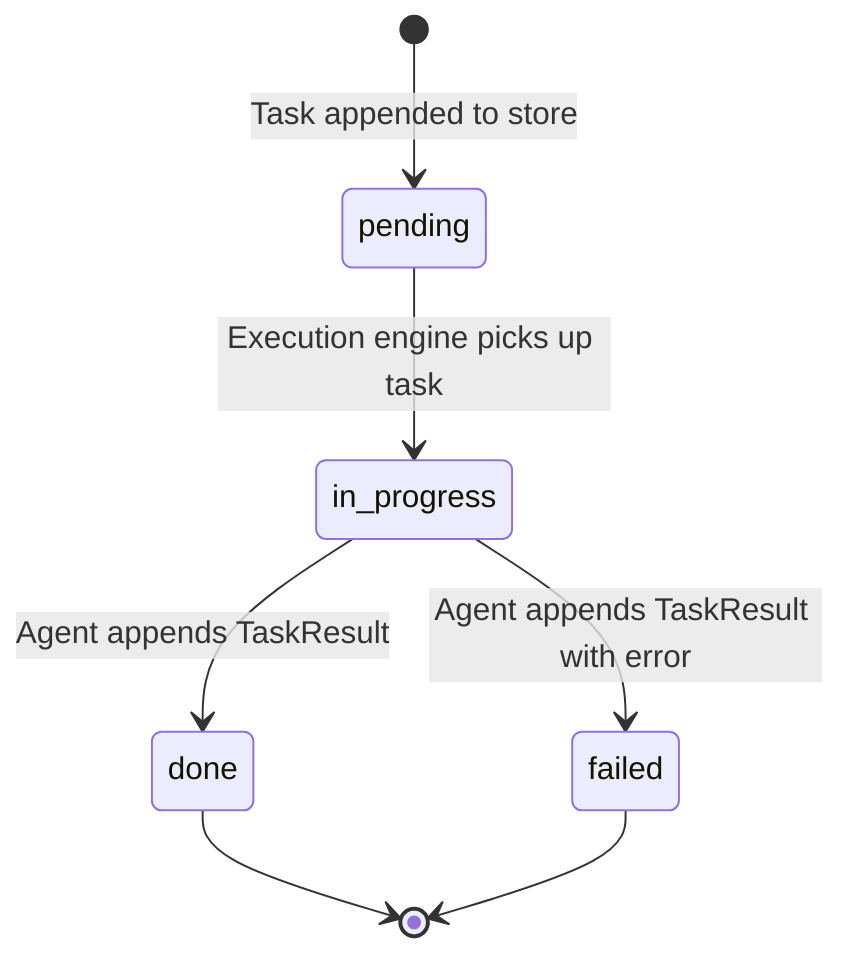

# Communication Patterns

All communication is expressed through three primitives: **Channel**, **Thread**, and **Task**.

- `Channel` — a shared conversation space that groups related threads and defines default participants or visibility.
- `Thread` — an individual conversation within a channel.
- `Task` — a unit of async work. Has a lifecycle (pending → in-progress → done/failed).

---

## Channel and thread structure

`Channel` is the parent communication space.

```ts
type Channel = ContextNode<"channel", {
  participantIds?: ContextId[];
  visibility?: "private" | "shared" | "public";
}>;
```

`Thread` belongs to a channel and carries the communication mode for that particular conversation.

```ts
type Thread = ContextNode<"thread", {
  channelId: ContextId;
  mode: "conversation" | "meeting" | "broadcast" | "stream";
  participantIds?: ContextId[];
}>;
```

### conversation — 1:1 sync

Two participants, turn-taking inside one thread. The current `Conversation` implementation most closely maps to this mode.

```
User ↔ Agent
```

### meeting — N:N sync

Multiple participants read the full thread and contribute. Used for multi-agent coordination where agents deliberate together inside a shared channel.

```
Agent A ↔ Agent B ↔ Agent C  (shared thread)
```

### broadcast — 1:N async

One sender, many receivers within the channel. Receivers do not reply into this thread. Used for publishing state or events to a group.

```
Agent A → [Agent B, Agent C, Agent D]
```

### stream — delta emission

Ordered sequence of partial outputs within one thread. Deltas are emitted as `Message` contexts with `role: "stream-delta"`, terminated by a `role: "stream-end"` message.

```
Agent A → delta → delta → delta → end
```

---

## Task

`Task` is a first-class context for async work assignment.

```ts
type Task = ContextNode<"task", {
  channelId: ContextId;      // channel where the task belongs
  threadId: ContextId;       // thread where work happens and result is posted
  assignedTo: ContextId;     // agent responsible for this task
  instruction: string;
  priority?: number;
}>;
```

Task status is tracked as a separate append-only event:

```ts
type TaskStatusChange = ContextNode<"task-status", {
  taskId: ContextId;
  status: "pending" | "in-progress" | "done" | "failed";
}>;

type TaskResult = ContextNode<"task-result", {
  taskId: ContextId;
  output: unknown;
}>;
```

Current task status = the `status` field of the latest `task-status` for a given `taskId`.

### Task lifecycle



---

## Pattern comparison

| Pattern      | Thread mode    | Sync | Participants | Reply expected |
|--------------|---------------|------|--------------|----------------|
| Conversation | conversation  | yes  | 2            | yes            |
| Meeting      | meeting       | yes  | N            | yes            |
| Broadcast    | broadcast     | no   | 1 + N        | no             |
| Stream       | stream        | no   | 1 + N        | no             |
| Async task   | any thread    | no   | 1 assignee   | via TaskResult |
