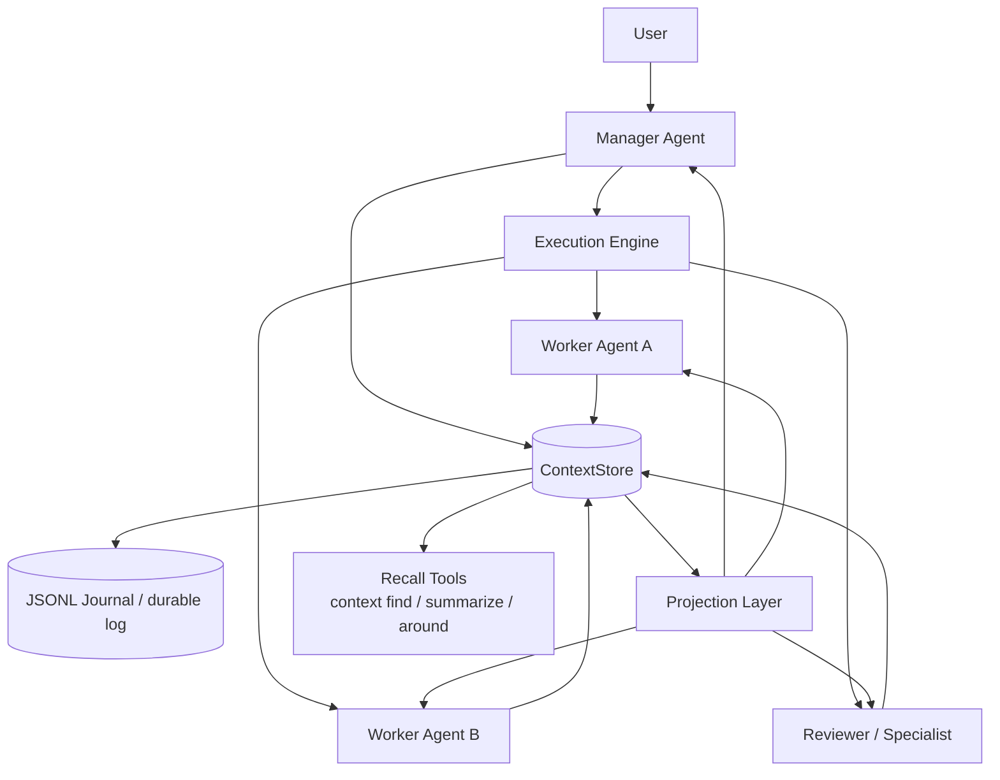

# Goal Architecture

This document describes the intended end-state architecture for `termy`.
It is a design target, not a claim that all of this is implemented today.

For the current implementation, see [`../architecture.md`](../architecture.md).
For the broader context philosophy, see [`../context-model.md`](../context-model.md).

---

## Design goal

`termy` should evolve from a single-thread conversational runtime into a **context-first multi-agent system** where:

- all important events are stored as append-only contexts
- a manager agent can spawn or activate specialist agents
- agents coordinate through shared contexts instead of ad-hoc internal APIs
- communication modes such as conversation, delegation, notification, and streaming are modeled explicitly
- each agent operates on a small working context and retrieves older context on demand

In short:

> **agents do not need to remember everything; they need a reliable context store and good recall tools**

---

## Core principles

### 1. Everything important is context

Messages, tool calls, task assignments, notifications, summaries, and results should all be represented as `ContextNode` records.

This keeps the system:

- observable
- replayable
- composable
- inspectable

### 2. Shared store, scoped views

The system may have one shared append-only `ContextStore`, but each agent should receive a **projection** of that store rather than the full raw history.

This allows:

- private and shared work to coexist
- manager-wide visibility with worker-local focus
- small prompts even when the global history grows large

### 3. Communication is modeled, not implied

Different coordination patterns should be represented explicitly instead of being hidden inside free-form messages.

Examples:

- `conversation` — synchronous turn-taking
- `meeting` — shared multi-agent discussion
- `broadcast` — one-to-many announcement
- `stream` — incremental output
- `task` / delegation — async work assignment
- `notification` — lightweight state change or event delivery

### 4. Long-term memory is retrieved, not always loaded

Agents should work with a bounded prompt budget.
Older context remains in the store and is retrieved only when needed via recall tools such as `context find`.

---

## Target runtime shape

At a high level, the target architecture looks like this:

---

## Main architectural roles

### Manager agent

The manager agent is responsible for orchestration.
Its role is to:

- interpret user goals
- decide whether more agents are needed
- spawn or activate worker agents
- create tasks
- monitor progress
- integrate partial results
- decide when to ask for recall or summarization

The manager should not do all work itself. It should primarily coordinate.

### Worker / specialist agents

Worker agents operate with narrower context and clearer responsibilities.
Examples:

- implementation worker
- research worker
- reviewer
- summarizer

A worker should:

- read its assigned task and relevant thread/channel contexts
- perform tool work
- append results, summaries, notifications, and follow-up questions
- request more context when needed

### Execution engine

The execution engine is imperative runtime code that reacts to new contexts.
It is responsible for:

- watching for pending tasks
- dispatching the correct agent
- enforcing retries / timeouts / watchdog behavior
- handling fan-out for broadcast-like patterns
- routing notifications to interested agents when needed

The engine is the scheduler, not the source of truth. The source of truth remains the context log.

---

## Communication model

`termy` should treat communication as a first-class design concern.

### Structural scopes

- `Channel` — shared space that groups related work
- `Thread` — one line of discussion or activity inside a channel

### Execution-oriented contexts

- `Task`
- `TaskStatusChange`
- `TaskResult`
- `ToolCall`
- `ToolResult`

### Coordination-oriented contexts

- `Message`
- `Notification`
- `Summary`
- future decision / artifact-reference style contexts if useful

### Recommended distinction

A useful separation is:

- **Message** = conversational contribution
- **Task** = work assignment with lifecycle
- **Notification** = lightweight event announcement
- **Summary** = compressed memory for later reuse

This avoids overloading plain messages with orchestration semantics.

---

## Spawn model

The system should support a manager creating or activating agents dynamically.

There are two compatible interpretations of "spawn":

### Logical spawn

A new agent definition, role, or activation request is created in the context system and assigned work.
This is the simplest version and likely the best first step.

### Runtime spawn

A new isolated runtime session/process is created to execute that agent role.
This allows stronger isolation, parallelism, and more explicit resource control.

The architecture should allow starting with logical spawn and later upgrading to runtime spawn without changing the context model.
In other words, agent definitions and lifecycle records belong in context, while agent execution itself remains a runtime concern.

---

## Memory model

The target system should separate **working context** from **stored history**.

### Working context

What an agent sees by default for one run, for example:

- role/system instructions
- the assigned task
- recent thread activity
- relevant summaries
- the most recent notifications addressed to that agent

### Stored history

The append-only context log, which may grow large over time.

### Recall layer

Tools and policies that bring old context back into the working set only when needed.

This architecture assumes that prompt context is scarce but stored context is cheap.

---

## Recall and `context find`

A future `context find` capability is central to this architecture.
Its purpose is to let agents recover relevant prior context instead of carrying the full past in every prompt.

Useful retrieval modes include:

- structural search
  - by channel, thread, task, type, agent, time range
- text search
  - keyword or phrase matches
- semantic search
  - conceptually related past contexts
- neighborhood search
  - contexts around a specific context id or event
- summary-first recall
  - fetch summaries before expanding raw history

Related helper tools may include:

- `context find`
- `context around`
- `context summarize`
- `context timeline`

---

## Retention and compression

Not every context needs to stay equally prominent in future projections.
A useful long-term policy is to distinguish between:

- `ephemeral` — useful only during immediate execution
- `working` — useful for near-term follow-up work
- `durable` — important decisions, results, and references
- `index-only` — metadata and references to external artifacts

A practical strategy is:

1. record raw events first
2. periodically append summaries
3. project summaries by default
4. retrieve raw detail only on demand

This keeps history rich without making prompts unbounded.

---

## Example coordination flow

A typical future flow may look like this:

1. user asks for a larger task
2. manager reads the current channel/thread context
3. manager creates tasks for specialist agents
4. execution engine dispatches those agents
5. workers append tool results, messages, summaries, and notifications
6. manager receives completion notifications or inspects task results
7. manager asks recall tools for older relevant context if needed
8. manager synthesizes the final response for the user

In this model, coordination happens through persisted context, not hidden in transient runtime state.

---

## Non-goals

This design does **not** require:

- every agent to read the entire context history
- every interaction to be synchronous
- every coordination step to be modeled as a plain message
- a separate bespoke messaging system outside the context store

---

## Relationship to the current implementation

Today, `termy` already has the first pieces of this architecture:

- append-only context records
- thread-scoped conversation
- tool call/result persistence
- projection from stored contexts into runtime input
- JSONL journaling

What is still missing is most of the higher-level coordination layer:

- channel-aware communication
- task and notification semantics in active use
- observable store subscriptions
- execution engine dispatch
- spawn lifecycle
- recall tools and memory policies

That means the current system is already aligned with the target direction, but is still at an early stage on the path toward it.
