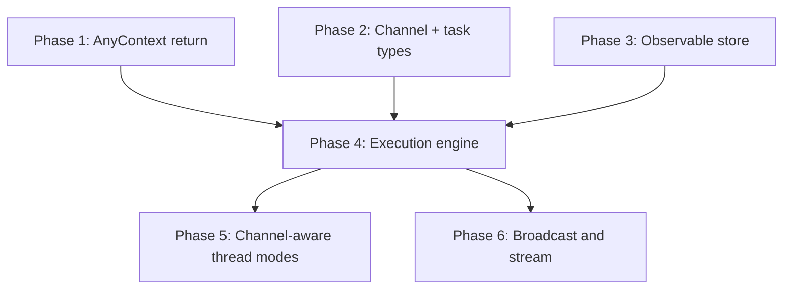

# Implementation Plan

Phased plan toward multi-agent coordination. Each phase is independently useful.

---

## Phase 1 — Agent as context processor

**Goal**: make `runContextsWithPi` return `AnyContext[]` instead of `Message`.

Changes:
- `runContextsWithPi(...): Promise<AnyContext[]>`
- `Conversation.sendUserMessage` adapts: extracts the `Message` from the returned array for its own return value, but stores all returned contexts
- `createAgent(...)` updated to wrap this

**Why first**: this is the load-bearing change. Every subsequent phase depends on agents being able to emit arbitrary contexts.

---

## Phase 2 — Channel and task context types

**Goal**: add `Channel`, `Task`, `TaskStatusChange`, `TaskResult` to `context-types.ts`.

Changes:
- new types in `context-types.ts`
- add to `AnyContext` union
- extend `Thread` with `channelId`
- add rendering in `context-text.ts`
- add filtering in `context-store.ts`: `listChannel(channelId)` and `listPendingTasks(agentId)`

No execution engine yet. Channels and tasks can be created and stored but are not automatically dispatched.

---

## Phase 3 — Observable ContextStore

**Goal**: `ContextStore.subscribe(listener)` fires on every `append`.

Changes:
- add `subscribe` to `ContextStore` interface
- update `createContextStore` implementation
- no breaking changes to existing callers

This is the interrupt mechanism. Downstream (phase 4) connects it to the execution engine.

---

## Phase 4 — Execution engine

**Goal**: a loop that dispatches pending tasks to agents.

Changes:
- new `createExecutionEngine(store, agents)` in `@termy/core`
- uses `store.subscribe` to trigger immediately on new `Task`
- `tick()` for watchdog / timeout handling
- CLI wires up the engine alongside the conversation

```ts
const engine = createExecutionEngine(store, {
  "agent:pi": contextAgent,
});
engine.start();
```

---

## Phase 5 — Channel-aware thread modes

**Goal**: extend `Thread` with `mode` and `participantIds`, under a `Channel` parent.

Changes:
- `Thread` payload gains `channelId`, `mode`, and optional `participantIds`
- `Channel` carries default participants and/or visibility
- `Conversation` becomes `mode: "conversation"` specialization
- new `createMeeting(...)` for `mode: "meeting"` threads
- projection layer respects channel/thread scoping and participant filtering

---

## Phase 6 — Broadcast and stream

**Goal**: broadcast and stream thread modes.

Changes:
- `broadcast`: execution engine fans out to all participant agents
- `stream`: `Message` gains `role: "stream-delta"` and `"stream-end"` variants
- CLI optionally renders stream deltas in real time

---

## Dependency graph



Phases 1, 2, 3 are independent and can be worked on in parallel.
Phase 4 requires all three.
