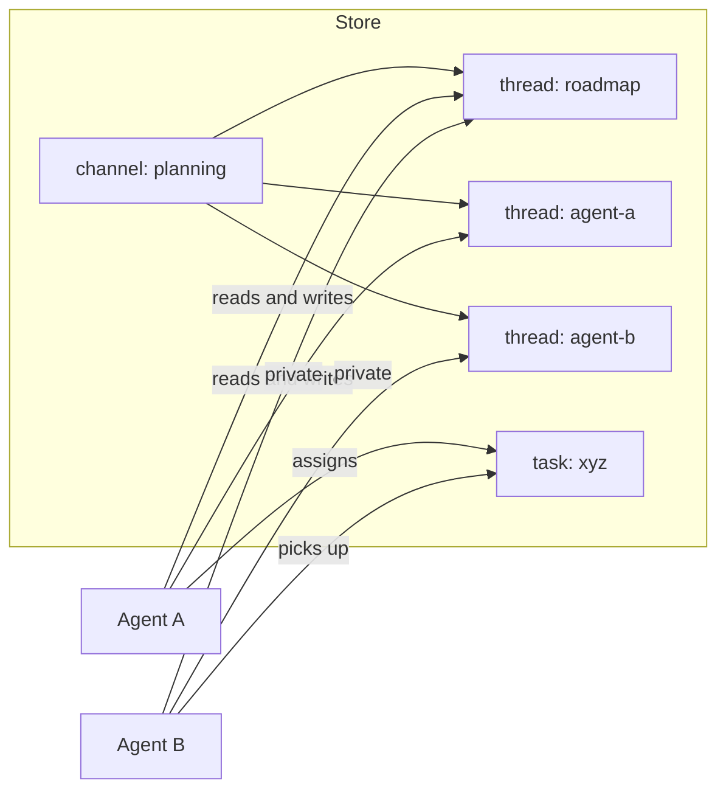

# Multi-Agent Coordination

## Shared ContextStore as message bus

Multiple agents share a single `ContextStore`. Communication between agents is context flowing through the store — there is no separate messaging layer.



---

## How agents coordinate

### Via Task (async delegation)

Agent A creates a `Task` context targeting Agent B. Agent B picks it up via the execution engine, processes it, and appends a `TaskResult`.

```
Agent A:
  store.append(Task {
    channelId: "channel:planning",
    threadId: "thread:roadmap",
    assignedTo: "agent-b",
    instruction: "summarize roadmap discussion"
  })

Execution engine:
  detects pending Task for agent-b → runs agent-b

Agent B:
  reads Task + thread:roadmap contexts
  store.append(TaskStatusChange { status: "done" })
  store.append(TaskResult { output: "..." })
```

### Via shared Thread (meeting)

All agents join a `thread` with `mode: "meeting"` inside a shared `channel`. Each agent reads the full thread, decides whether to respond, and appends a `Message`. The execution engine determines turn order.

---

## Execution engine

The execution engine is **imperative code, not a context**. It is the clock that drives the system.

Responsibilities:
1. Watch the store for pending `Task` contexts
2. Dispatch the assigned agent
3. Handle timeouts (watchdog)

```ts
async function tick(store: ContextStore, agents: Map<ContextId, AgentRun>) {
  const pendingTasks = getPendingTasks(store);
  for (const task of pendingTasks) {
    const agent = agents.get(task.payload.assignedTo);
    if (!agent) continue;

    markInProgress(store, task.id);
    const contexts = store.listThread(task.payload.threadId);
    const output = await agent(contexts);
    store.appendMany(output);
  }
}
```

`getPendingTasks` finds `Task` contexts whose latest `task-status` is `"pending"` (or has no status yet).

### Interrupt vs polling

Two approaches:

| | Interrupt (event-driven) | Clock (polling) |
|-|--------------------------|-----------------|
| Trigger | `store.subscribe(listener)` fires on append | `setInterval` / manual `tick()` |
| Latency | immediate | up to tick interval |
| Complexity | requires observable store | simple loop |
| Use case | main execution path | watchdog, timeouts |

Recommended: **interrupt-driven as primary, clock as watchdog**.

The interrupt hook requires `ContextStore` to be observable:

```ts
interface ContextStore {
  // existing...
  subscribe(listener: (context: AnyContext) => void): () => void;
}
```

When a `Task` is appended, the listener fires immediately and the execution engine dispatches the assigned agent without waiting for a tick.

### Clock for watchdog only

```ts
setInterval(() => {
  const stuck = getInProgressTasksOlderThan(store, timeout);
  for (const task of stuck) {
    markFailed(store, task.id, "timeout");
  }
}, WATCHDOG_INTERVAL);
```

---

## Agent interface

Any agent — human-facing or internal — implements the same interface:

```ts
type AgentRun = (contexts: AnyContext[]) => Promise<AnyContext[]>
```

This makes agents composable. The output of one agent is the input of another.

### Upgrade path from current implementation

```ts
// current (string in, string out)
createAgent({ runtime }).run(input: string): Promise<string>

// target (context in, context out)
createContextAgent({ runtime }): AgentRun
// (contexts: AnyContext[]) => Promise<AnyContext[]>
```

`Conversation` becomes the single-thread specialization of this general interface, while channels provide the broader grouping structure above it.
